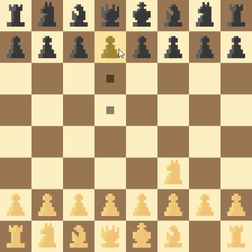

# **OXIDE GAMBIT**

This is a chess engine written in Rust.

It probably will not be very good.

# **THIS PROJECT IS CURRENTLY UNDERGOING A MAJOR REWRITE**

|Icon|Meaning|
|----------|--------|
|🟢|Complete|
|🟡|In Progress|
|🔴|Planned|
|🔵|Maybe?|

## **Chess Logic** 
| Feature | Status |
|-| :-: |
|Rewrite Most of This (It's Bad)|🟡|
|Foundational Stuff|🟢|
|Basic move generation|🟢|
|why is the king so annoying re|🔴|
|En Passant, Castling, Promotion, etc.|🔴|

## **Evaluation Function**
| Feature | Status |
|-| :-: |
|Piece Counting|🟢|
|Board Mask|🟢|
|Threatened Squares|🟢|
|Pawn Structure|🔴|
|Gradient Descent Constant Tweaker|🔵|

## **Search Algorithm**
| Feature  | Status |
|-| :-: |
|Minimax|🟢|
|Alpha Beta Pruning|🟢|
|Move Ordering|🟢|
|Transposition Table|🟡|
|Iterative Deepenning|🔴|
|Nullmove pruning|🔴|
|Opening Book|🔴|
|Late-Move Reduction|🔵|
|Quiessence Search|🔵|

## **To-Do:**
| Feature  | Status |
|-| :-: |
|Make It Good|🔴|

`..default()`
